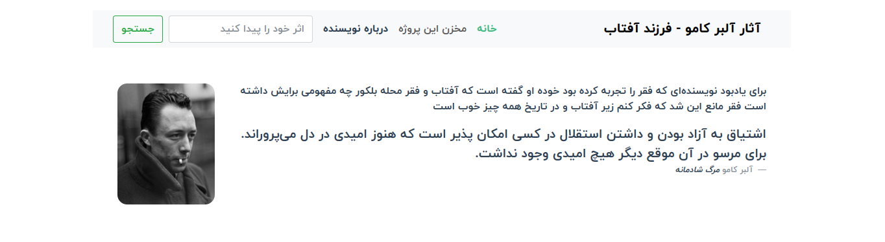

  <h2>Albert Camus</h2>
  
  
<i>
        In memory of a writer who experienced poverty, he himself said what the sun and poverty of Belkor neighborhood meant to him. Poverty prevented me from thinking that everything is good under the sun and in history.
  </i>

