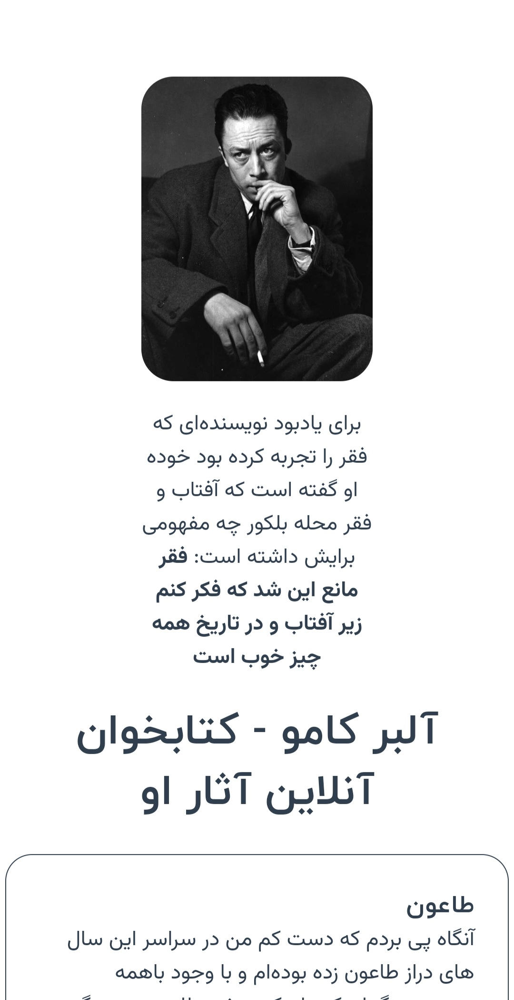

من برآن شدم تا نکته و دریافتی های خود را از خواندن آثار نویسنده ای اعجاب انگیز به قالب یک مجموعه دیجیتالی تنظیم کنم.

  <h2>آلبر کامو🤍</h2>
  
  
<i>
        برای یادبود نویسنده‌ای که فقر را تجربه کرده بود خوده او گفته است که آفتاب و فقر محله بلکور چه مفهومی برایش داشته است فقر مانع این شد که فکر کنم زیر آفتاب و در تاریخ همه چیز خوب است
  </i>

تا شاید کتاب ها را خوب درک کردم و در کنارش با فنجان قهوه‌ام کانسپت vue.js و نحوه کامونیکیشن با scss رو بفهمم و کم کم یک چیز خوب و جمع جور رو با هم لانچ کنیم.

بفهیم که برای ساخت چیزای بزرگ نیاز نیست همون ابتدا بزرگ باشن، بلکه یه نسخه کوچیک ازشون کافیه تا کم‌کم مثل یک درخت و ریشه‌هاش راه خودش رو پیدا کنه و بزرگ بشه.
